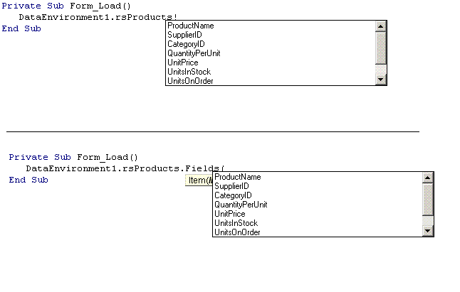

<div align="center">

## IntellisenseDEnv


</div>

### Description

Intellisense for DataEnvironments Recordset Commands

It adds the intellisense feature for the DataEnvironment commands that return a

recordset.

It identifies the DataEnvironment and the Command name as you type. It works both cu "!"

and with ".fields(" (ex. DataEnvironment1.rsCommand1!FieldName and

DataEnvironment1.rsCommand1.Fields("FieldName").

It ain't perfect but it can be made better (if you can, please do so).Anyway, this is the kind of feature that I was looking for a long time. Couldn't find it so I've made it. I hope it proves useful to you too.

Large portions of this code were adapted from grigri's addin:

http://www.Planet-Source-Code.com/vb/scripts/ShowCode.asp?txtCodeId=53146&amp;lngWId=1

I've tried to combine the two addins, but the outcome was too unstable.

Enjoy!
 
### More Info
 


<span>             |<span>
---                |---
**Submitted On**   |2004-10-22 02:53:00
**By**             |[Florin Florea](https://github.com/Planet-Source-Code/PSCIndex/blob/master/ByAuthor/florin-florea.md)
**Level**          |Advanced
**User Rating**    |5.0 (25 globes from 5 users)
**Compatibility**  |VB 6\.0
**Category**       |[Miscellaneous](https://github.com/Planet-Source-Code/PSCIndex/blob/master/ByCategory/miscellaneous__1-1.md)
**World**          |[Visual Basic](https://github.com/Planet-Source-Code/PSCIndex/blob/master/ByWorld/visual-basic.md)
**Archive File**   |[Intellisen19423210212005\.zip](https://github.com/Planet-Source-Code/florin-florea-intellisensedenv__1-62981/archive/master.zip)

### API Declarations

```
Public Declare Function SetFocus Lib "user32.dll" (ByVal hwnd As Long) As Long
Public Declare Function GetFocus Lib "user32.dll" () As Long
Public Declare Function GetClassName Lib "user32.dll" Alias "GetClassNameA" (ByVal hwnd As Long, ByVal lpClassName As String, ByVal nMaxCount As Long) As Long
Public Declare Function GetCaretPos Lib "user32.dll" (lpPoint As POINTAPI) As Long
Public Declare Function ClientToScreen Lib "user32.dll" (ByVal hwnd As Long, lpPoint As POINTAPI) As Long
Public Declare Function GetAsyncKeyState Lib "user32.dll" (ByVal vKey As Long) As Integer
Public Declare Function SetWindowPos Lib "user32.dll" (ByVal hwnd As Long, ByVal hWndInsertAfter As Long, ByVal X As Long, ByVal Y As Long, ByVal cx As Long, ByVal cy As Long, ByVal wFlags As Long) As Long
Public Declare Function RedrawWindow Lib "user32.dll" (ByVal hwnd As Long, lprcUpdate As Any, ByVal hrgnUpdate As Long, ByVal fuRedraw As Long) As Long
Public Declare Function CallNextHookEx Lib "user32.dll" (ByVal hHook As Long, ByVal nCode As Long, ByVal wParam As Long, lParam As Any) As Long
Public Declare Function SetWindowsHookEx Lib "user32.dll" Alias "SetWindowsHookExA" (ByVal idHook As Long, ByVal lpfn As Long, ByVal hmod As Long, ByVal dwThreadId As Long) As Long
Public Declare Function UnhookWindowsHookEx Lib "user32.dll" (ByVal hHook As Long) As Long
```


